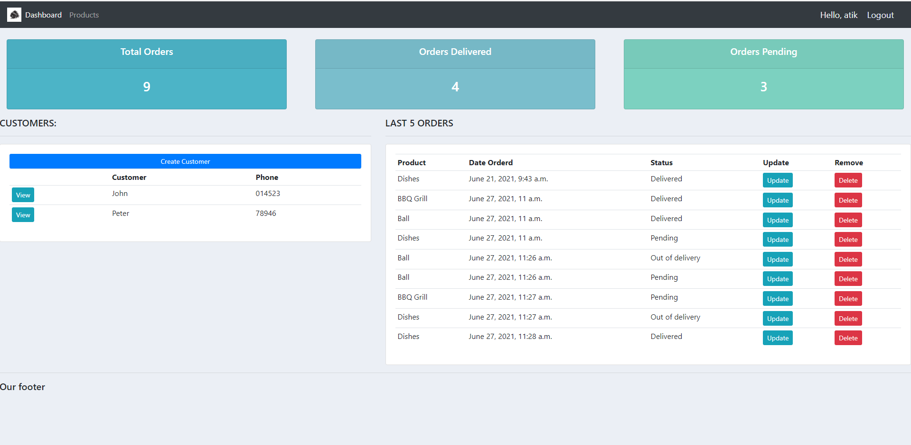
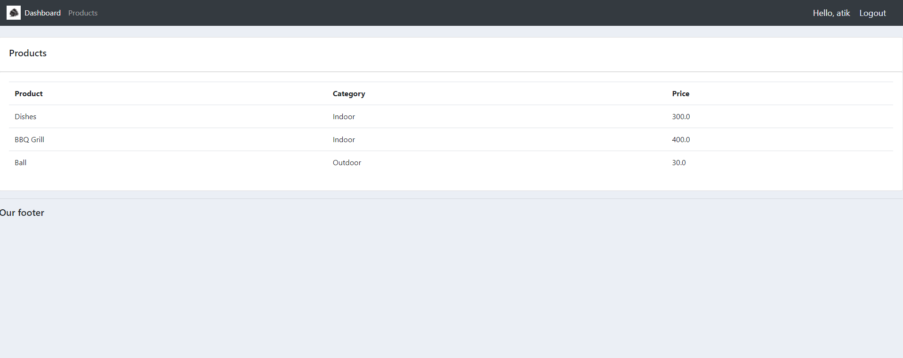
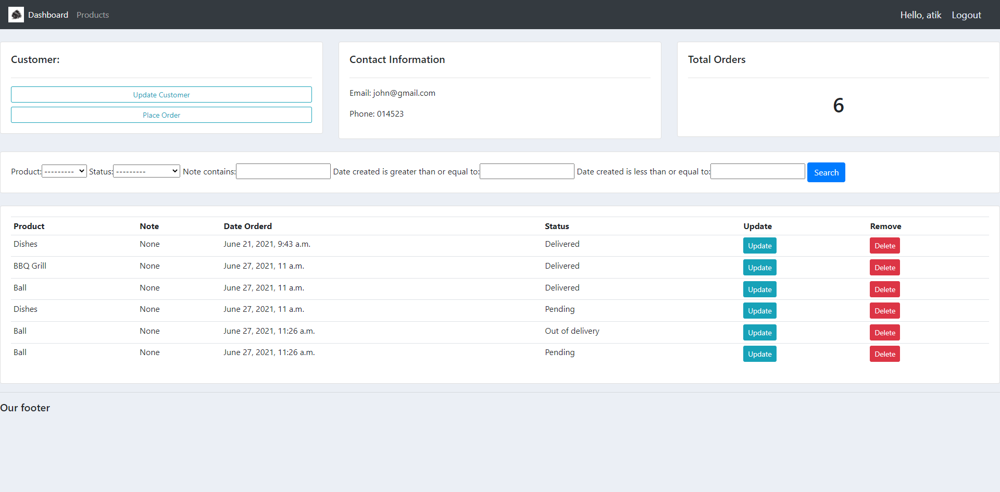
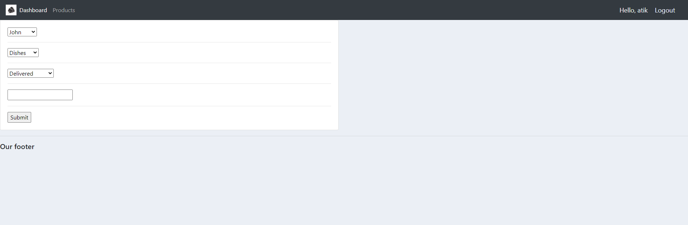
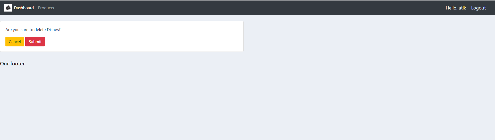

# Online_Shop_Management
This is a Django based project where you can create or delete customer and can handle their delivery status and can update product lists and other functionalities

Home page

Products page

Customer product details

Update page

Delete page

